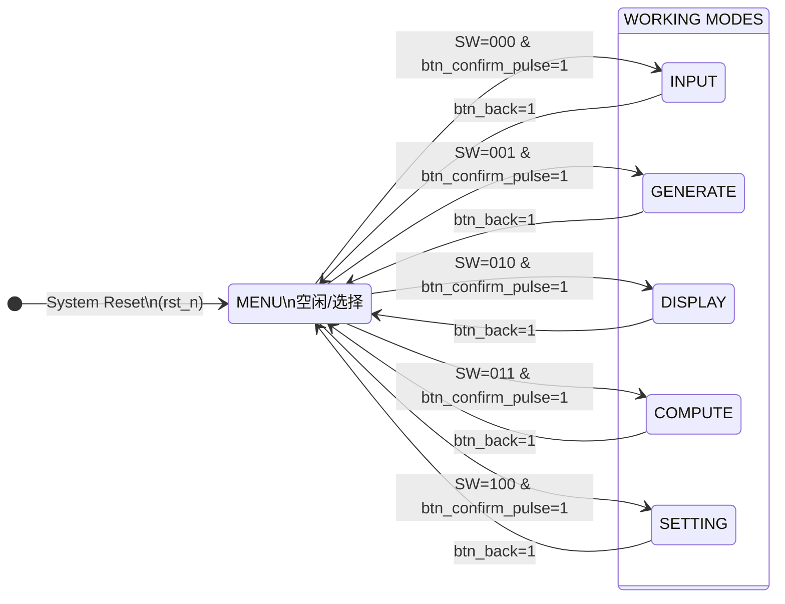
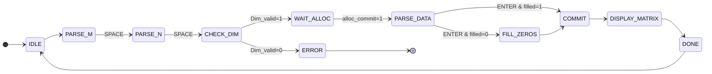
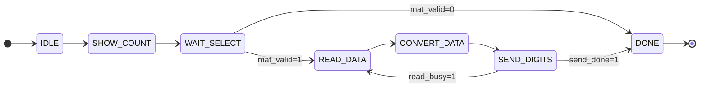
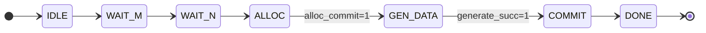
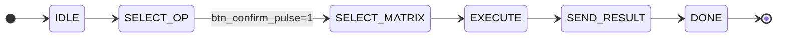

**Top**

```mermaid
stateDiagram-v2
    direction LR
    
    %% 初始状态
    [*] --> IDLE_MENU : System Reset\n(rst_n)
    
    %% 主菜单状态（加大空间）
    state "MENU\n空闲/选择" as IDLE_MENU
    
    %% 工作模式组
    state "WORKING MODES" as ACTIVE {
        direction TB
        
        state "INPUT" as S_INPUT
        state "GENERATE" as S_GEN
        state "DISPLAY" as S_DISP
        state "COMPUTE" as S_COMP
        state "SETTING" as S_SET
    }
    
    %% 模式选择转移（简洁标签）
    IDLE_MENU --> S_INPUT : SW=000 & btn_confirm_pulse=1
    IDLE_MENU --> S_GEN   : SW=001 & btn_confirm_pulse=1
    IDLE_MENU --> S_DISP  : SW=010 & btn_confirm_pulse=1
    IDLE_MENU --> S_COMP  : SW=011 & btn_confirm_pulse=1
    IDLE_MENU --> S_SET   : SW=100 & btn_confirm_pulse=1
    
    %% 强制返回（统一标签）
    S_INPUT --> IDLE_MENU : btn_back=1
    S_GEN   --> IDLE_MENU : btn_back=1
    S_DISP  --> IDLE_MENU : btn_back=1
    S_COMP  --> IDLE_MENU : btn_back=1
    S_SET   --> IDLE_MENU : btn_back=1
```
**INPUT**

```mermaid
stateDiagram-v2
    direction LR
    [*] --> IDLE
    IDLE --> PARSE_M
    PARSE_M --> PARSE_N : SPACE
    PARSE_N --> CHECK_DIM :  SPACE
    CHECK_DIM --> WAIT_ALLOC : Dim_valid=1
    CHECK_DIM --> ERROR : Dim_valid=0
    WAIT_ALLOC --> PARSE_DATA : alloc_commit=1
    PARSE_DATA --> FILL_ZEROS : ENTER & filled=0
    PARSE_DATA --> COMMIT : ENTER & filled=1
    FILL_ZEROS --> COMMIT
    COMMIT --> DISPLAY_MATRIX
    DISPLAY_MATRIX --> DONE
    DONE --> IDLE
    ERROR --> [*]
```
**DISPLAY**

```mermaid
stateDiagram-v2
    direction LR
    [*] --> IDLE
    IDLE --> SHOW_COUNT
    SHOW_COUNT --> WAIT_SELECT
    WAIT_SELECT --> READ_DATA : mat_valid=1
    WAIT_SELECT --> DONE : mat_valid=0
    READ_DATA --> CONVERT_DATA
    CONVERT_DATA --> SEND_DIGITS
    SEND_DIGITS --> READ_DATA : read_busy=1
    SEND_DIGITS --> DONE : send_done=1
    DONE --> [*]
```

**GENERATE**

```mermaid
stateDiagram-v2
    direction LR
    [*] --> IDLE
    IDLE --> WAIT_M
    WAIT_M --> WAIT_N
    WAIT_N --> ALLOC
    ALLOC --> GEN_DATA : alloc_commit=1
    GEN_DATA --> COMMIT : generate_succ=1
    COMMIT --> DONE
    DONE --> [*]
```

**COMPUTE**

```mermaid
stateDiagram-v2
    direction LR
    [*] --> IDLE
    IDLE --> SELECT_OP
    SELECT_OP --> SELECT_MATRIX : btn_confirm_pulse=1
    SELECT_MATRIX --> EXECUTE
    EXECUTE --> SEND_RESULT
    SEND_RESULT --> DONE
    DONE --> [*]
```